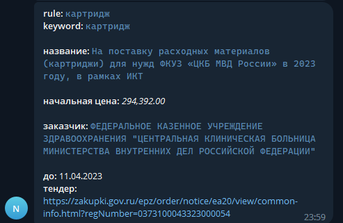

# Мониторинг закупок

### Мониторинг новых (где идет прием заявок) закупок/тендеров по ключевым словам и уведомление о появлении закупки в Телеграм чат/канал

#### Ресурсы закупок:
1. [x] [zakupki.gov.ru](https://zakupki.gov.ru)
2. [x] [zakupki.mos.ru](https://zakupki.mos.ru)


#### Фильтры поиска:
1. [x] [zakupki.gov.ru](https://zakupki.gov.ru)
   * Поменять регион (по умолчанию регион - Москва) поиска закупок или других фильтров поиска можно в файле `src/eis/eis.py`. Значение переменной **URL**.
2. [x] [zakupki.mos.ru](https://zakupki.mos.ru)
   * Поменять регион (по умолчанию регион - Москва) поиска закупок или других фильтров поиска можно в файле `src/mos/mos.py`. Функция **get_api_url()**.

_Если нужно поменять фильтры, то необходимо зайти на ресурс и отправить запрос проставив нужные фильтры при поиске, и посмотреть параметры фильтров в URL адресе с помощью инструмента веб-разработки_.

#### ENV в Dockerfie:
* TG_BOT_TOKEN - токен Телеграм бота.
* TG_CHAT_ID - ID Телеграм чата/канала.
* SLEEP_TIME - время, через которое запускается мониторинг (минуты).

#### Пример ключевых слов для поиска (файл `data/search_rules.json`):
```json
[
  {
    "product_category": "Жёсткие диски", // !не используется при поиске, только для сообщения в тг!
    "keywords": ["hdd"] // список ключевых слов для поиска
  },
  {
    "product_category": "Видеокарты",
    "keywords": ["Видеокарты"]
  }
]
```


## Запуск

###### Собрать образ:
```shell
$ docker build -t zakipki_monitoring --build-arg TG_BOT_TOKEN='<token>' TG_CHAT_ID=<chat/channel id> SLEEP_TIME=<time>
```

###### Запуск образа:
```shell
$ docker run zakipki_monitoring
```

###### Пример сообщения в Телеграм о найденной закупке по ключевым словам:


### _**Удачи!**_